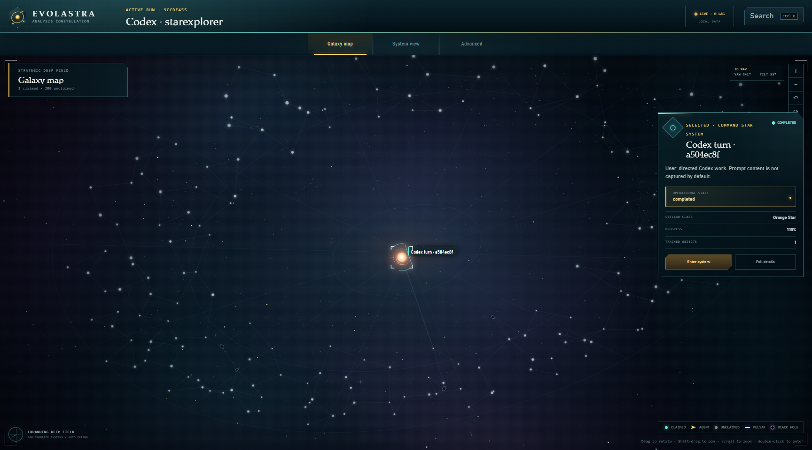
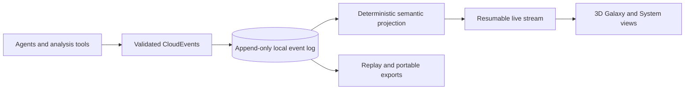

<div align="center">
  
  <h1>Evolastra Observatory</h1>
  <p><strong>A local-first mission control for agentic analysis, evidence, and provenance.</strong></p>
  <p>Watch an investigation become a navigable 3D galaxy without surrendering its data.</p>

  <p>
    <a href="https://github.com/paureel/evolastra/actions/workflows/ci.yml"></a>
    <a href="https://github.com/paureel/evolastra/stargazers"></a>
    
    
    
    
  </p>
</div>



Evolastra receives durable analytical events, projects them into a semantic evidence graph, and renders that graph through two spatial lenses: a strategic Galaxy Map for the full investigation and an orbital System View for a single analytical branch. The visualization is disposable; the append-only event log and semantic model remain the source of truth.

## Start here

On Windows with Python 3.12+, Node.js 20+, and repository access:

```powershell
gh repo clone Paureel/evolastra
Set-Location evolastra
npm run bootstrap
```

The bootstrap installs locked dependencies, builds the viewer, installs and starts the Local Private companion, configures Codex hooks, verifies the result, and opens the local viewer. Restart Codex once, approve the commands shown by `/hooks`, then run `& .\.venv\Scripts\evolastra.exe pair` to connect the browser.

**Using an agent?** Ask it to read [`AGENTS.md`](AGENTS.md), or copy the ready-made prompt from the [Getting Started guide](docs/getting-started.md#-let-an-agent-set-it-up).

For a demo without Codex integration, follow [Run the demo only](docs/getting-started.md#-run-the-demo-only). The complete installation guide includes prerequisites, verification checkpoints, options, and exact troubleshooting steps.

## Why Evolastra

- **See the analysis happen.** Runs, branches, agents, tools, artifacts, findings, anomalies, and approvals become distinct inspectable objects; bounded numeric artifacts become safe local figures rather than executable uploads.
- **Navigate in 3D.** Both maps support perspective depth, unrestricted 360° rotation, tilt, pan, zoom, and keyboard camera controls.
- **Launch work from the map.** Build Codex vessels at the command star, unlock problem-specific hulls through research, and dispatch explicit missions into new local Codex tasks.
- **Federate a project privately.** Opt into host-authoritative multiplayer through Tailscale, claim semantically positioned research systems with player colors, and publish selected finding summaries while Netlify stays storage-free.
- **Never lose the trail.** Replay, deterministic projections, typed relationships, and portable exports preserve how a conclusion was reached.
- **Keep data local.** The companion, SQLite database, artifacts, Codex outbox, and access capability remain on the user’s machine.
- **Integrate without lock-in.** CloudEvents, W3C trace concepts, JSONL, OpenLineage exports, SDKs, and narrow adapters provide explicit boundaries.
- **Stay connected.** A sparse inner frontier flows out from the command star, while claimed systems and the full generated field remain one traversable hyperlane graph—no isolated islands.

## How it works



The architecture deliberately separates three concerns:

| Layer | Owns | Never owns |
| --- | --- | --- |
| Operational telemetry | Traces, spans, logs, metrics | Analytical meaning |
| Semantic graph | Runs, evidence, lineage, findings, approvals | Camera or layout state |
| Visualization | Coordinates, animation, camera, visual aggregation | Canonical evidence |

Read the [architecture overview](docs/architecture/overview.md) and [shared contract](docs/architecture/shared-contract.md) for the complete model.

## Manual development setup

### Prerequisites

- Windows PowerShell 5.1 or newer
- Python 3.12
- Node.js 20 and npm 10

Docker is not required.

```powershell
powershell -NoProfile -ExecutionPolicy Bypass -File .\scripts\setup.ps1
npm run demo
```

Open [http://127.0.0.1:5173](http://127.0.0.1:5173). The API and its OpenAPI UI are available locally at [http://127.0.0.1:8000](http://127.0.0.1:8000) and [http://127.0.0.1:8000/docs](http://127.0.0.1:8000/docs).

Use `npm run dev` for an empty observatory or `npm run seed` to load the demonstration immediately.

## Camera and map controls

| Input | Action |
| --- | --- |
| Drag | Rotate the 3D camera |
| Shift-drag or middle/right drag | Pan |
| Mouse wheel or `+` / `-` | Zoom |
| `W` / `S` | Tilt |
| `A` / `D` | Rotate |
| Arrow keys | Inspect the previous or next object |
| `Home` | Reset the camera |
| Double-click a claimed star | Enter its System View |

## Connect Evolastra to Codex

Install and start the Local Private companion once:

```powershell
& .\.venv\Scripts\evolastra.exe service install
& .\.venv\Scripts\evolastra.exe service start
```

Restart Codex, review the managed hooks through `/hooks`, and pair a browser tab with:

```powershell
& .\.venv\Scripts\evolastra.exe pair
```

The included [`evolastra` Codex skill](skills/evolastra/SKILL.md) can install, start, pair, and diagnose the companion. See [Codex hooks](docs/integration/codex-hooks.md) and [Local Private deployment](docs/deployment/local-private.md) for operational details.

Once paired, enter the starting System View and click its central command star to
open the [shipyard](docs/user-guide/shipyard.md). Each launch creates a new task
through the same signed-in Codex installation; the browser never receives Codex
credentials.

For cooperative work, open **Single player** in the command bar. The
[multiplayer guide](docs/user-guide/multiplayer.md) explains how a host exposes
only the federation path through Tailscale, how guests load the matching project,
and exactly which collaboration fields are shared.

### Multiplayer quick start

Every participant installs Evolastra and Tailscale, joins the same private
tailnet, and loads the same `.evolastra` analysis locally. On the host only,
expose the bounded federation route:

```powershell
tailscale serve --bg --set-path /api/v1/federation http://127.0.0.1:8000/api/v1/federation
```

The host chooses **Single player → Host project**, enters the device's HTTPS
`.ts.net` address, and shares the generated `EVO1…` invite privately. Guests use
**Single player → Join project**. Stop the route after the session with
`tailscale serve reset`.

The invite contains no project bytes. Netlify remains a static host, each Codex
ship stays under its owner's local companion, and single player continues to
work without Tailscale. Do not use Tailscale Funnel.

## Privacy model

The hosted viewer is static presentation code. It contains no API, ingestion service, database, or analytical storage. Each browser pairs directly with a loopback companion using a one-use code and receives a short-lived, origin-bound grant. Redaction occurs before local persistence.

See the [privacy model](docs/security/privacy-model.md), [threat model](docs/security/threat-model.md), and [redaction policy](docs/security/redaction-policy.md).

## Integrations and exports

### Input surfaces

- HTTP: `POST /api/v1/events` and `POST /api/v1/events/batch`
- JSONL: `POST /api/v1/imports/jsonl`
- Live stream: `GET /api/v1/runs/{run_id}/events/stream?after=<sequence>`
- Python SDK: [`sdk/python/galaxy_sdk`](sdk/python/galaxy_sdk)
- Codex hook examples: [`examples/integrations/codex`](examples/integrations/codex)
- Narrow adapters: AG-UI, A2A, OpenAI Agents tracing, OTLP JSON, and OpenLineage

### Export formats

CloudEvents JSONL, OpenLineage JSON, W3C PROV JSON-LD, Obsidian notes, a non-executable reproduction ZIP, and portable `.evolastra` analyses.

The [integration matrix](docs/integration/README.md) distinguishes implemented, fixture-tested, interface-only, and deferred surfaces.

## Development

```powershell
npm run doctor       # diagnose tools and installed dependencies
npm run harness      # repository knowledge and architecture invariants
npm run check        # fast preflight without browser/audit work
npm run verify       # complete release gate
npm run benchmark    # deterministic reducer benchmark
npm run lint
npm run typecheck
npm test
npm run build
npm run security
```

Database helpers are `npm run migrate`, `npm run reset`, and `npm run seed`.

Coding agents start with [`AGENTS.md`](AGENTS.md), follow the nearest local
instructions, and use the [repository harness](docs/development/harness.md).
Cross-cutting work is captured as a [versioned plan](docs/plans/README.md), while
architecture boundaries are checked automatically instead of living only in
prose.

## Repository map

```text
apps/api/       FastAPI companion, event store, projection, exports
apps/web/       React/Vite observatory and Canvas renderer
integrations/   Protocol adapters and normalized event mappings
schemas/        Versioned CloudEvent and semantic event schemas
sdk/            Python and TypeScript client surfaces
skills/         Codex skill for operating Evolastra
tests/          Domain, contract, security, quality, property, chaos tests
docs/           Architecture, deployment, integration, security, user guides
```

Start with the [documentation index](docs/README.md), [repository map](docs/architecture/repository-map.md), [contribution guide](CONTRIBUTING.md), and [testing strategy](docs/development/testing.md).

## Project status

Evolastra is an experimental, local-first observatory. Single player is the default; Phase 1 multiplayer is an opt-in host-authoritative overlay for known members of a private Tailscale network. SQLite is the verified persistence profile. The repository documents deferred production-scale components and verified support boundaries rather than presenting them as implemented. See the [gap matrix](docs/audit/gap-matrix.md) and [quality report](docs/audit/quality-report.md).

## License

This is a private repository. All rights are reserved; no license is granted unless the repository owner provides one separately.
