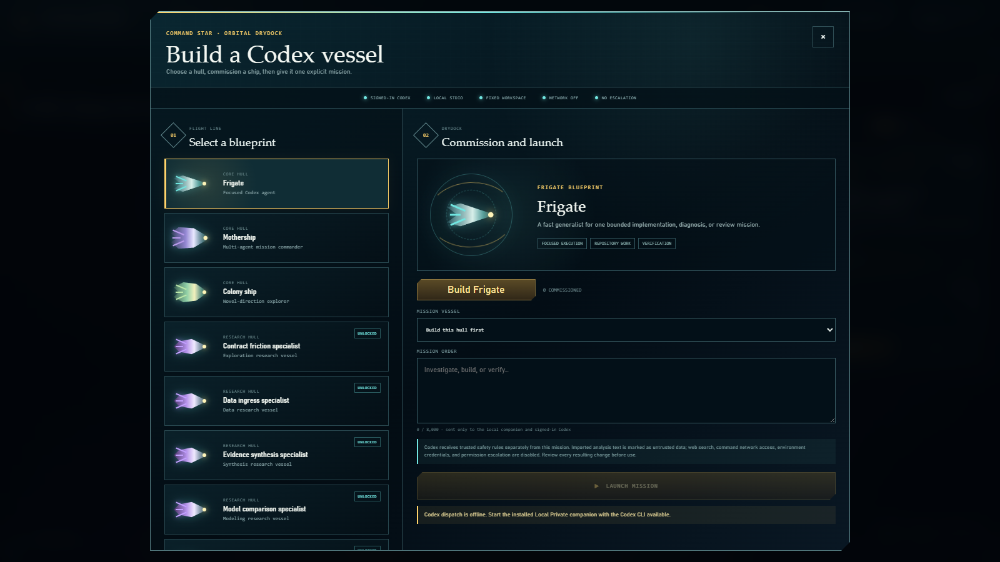
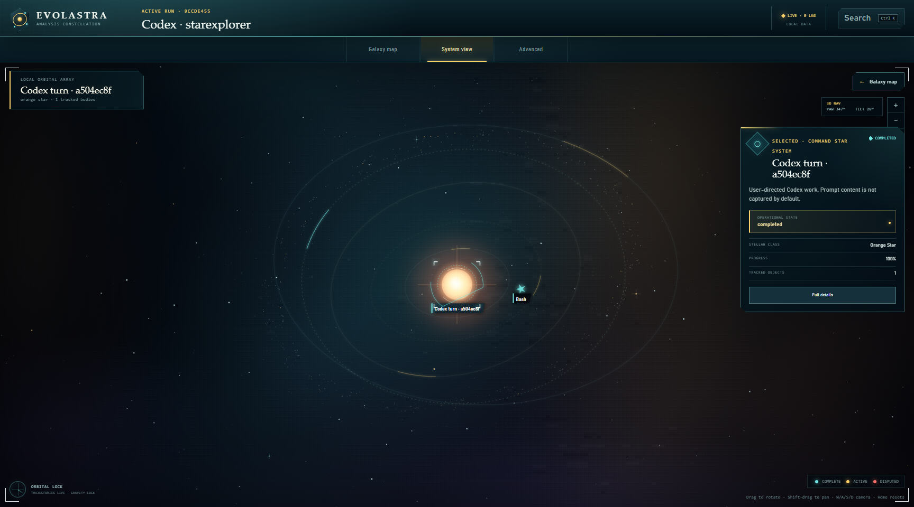
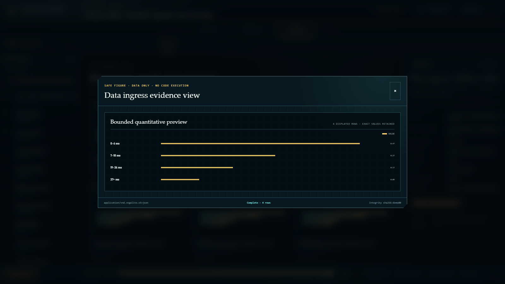
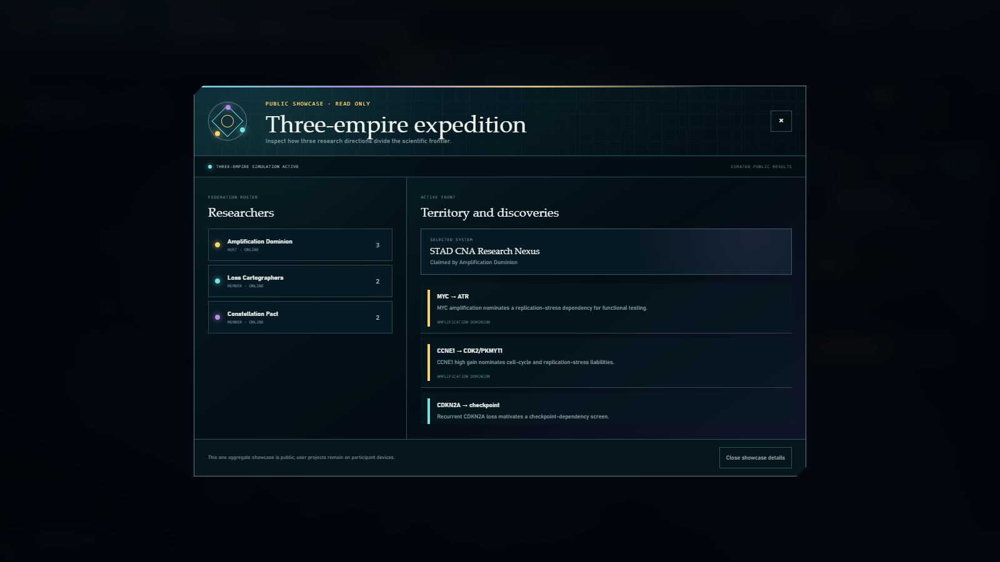
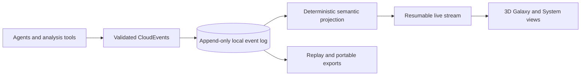

<div align="center">
  
  <h1>Evolastra Observatory</h1>
  <p><strong>Turn data analysis into a space empire while Codex works.</strong></p>
  <p>A local-first observatory for agentic data analysis: commission Codex ships, explore hypotheses, inspect figures and evidence, and watch analytical work become systems, fleets, and expanding borders.</p>

  <p>
    <a href="https://evolastra.netlify.app"><strong>🚀 Open Evolastra</strong></a>
  </p>

  <p>
    <a href="https://github.com/paureel/evolastra/actions/workflows/ci.yml"></a>
    <a href="https://github.com/paureel/evolastra/stargazers"></a>
    
    
    
    <a href="LICENSE"></a>
    
  </p>

  <p>
    <a href="https://github.com/Paureel/evolastra">GitHub</a>
    ·
    <a href="https://x.com/aurel_pr">Follow @aurel_pr on X</a>
  </p>
</div>

## Your data analysis becomes a strategy game

Evolastra is a playable command layer built primarily for real data analysis.
Your dataset and analytical objective begin as a command star. You build a
fleet, issue investigations in plain language, and Codex opens new tasks using
the same local installation you already use. As agents inspect data, test
hypotheses, validate results, and produce figures, the galaxy grows around them.

| In your empire | In the underlying work |
| --- | --- |
| The command star | Your project and primary objective |
| Frigates | Focused Codex tasks for implementation, diagnosis, or review |
| Motherships | Coordinated Codex tasks that can dispatch bounded subagents |
| Colony ships | Missions prompted to explore novel, testable directions |
| Research systems | Semantic branches, hypotheses, and technical directions |
| Planets and orbital bodies | Evidence, artifacts, tools, findings, and anomalies |
| Hyperlanes | Provenance, dependency, and analytical relationships |
| Expanding borders | Validated progress and multiplayer ownership |

The galaxy is not a decorative dashboard. Analysis systems colonize stars that
were already visible in the connected frontier, retaining those coordinates and
hyperlanes as the investigation grows. Semantic signatures remain inspectable
metadata rather than controlling map distance. The durable event history and
semantic evidence graph stay authoritative underneath the game.

### 1. Commission your Codex fleet

Click the command star to open the shipyard. Build a **Frigate** for one focused
task, a **Mothership** for coordinated subagents, or a **Colony ship** to explore
novel directions. Completed tech-tree research unlocks problem-specific hulls.
Give the vessel a mission and Evolastra opens a new task through the same
signed-in Codex installation, then projects its progress back onto the map.

<p align="center">
  
</p>

Ship missions are explicit and local: trusted safety instructions are separated
from untrusted analytical context, command network access and web search are
disabled, ambient credentials are filtered, and writes stay inside the
repository workspace without approval escalation.

### 2. Watch the empire expand while Codex works

Agents appear as moving ships. New analytical directions become claimable star
systems. Evidence and tools accumulate in orbit. Validated advances grow smooth
territorial borders across the flat galactic plane. Rotate, tilt, pan, and zoom
the strategic map in full 3D while work continues in the background.

<p align="center">
  
</p>

### 3. Enter a system and inspect what your ships found

Every claimed system opens into an orbital view of its local agents, tool calls,
evidence, artifacts, findings, and anomalies. The same work is also available
through searchable text views, inspectors, the tech tree, and provenance tables.

<p align="center">
  
</p>

### 4. Replay discoveries or divide the frontier with friends

<table>
  <tr>
    <td width="50%">
      
    </td>
    <td width="50%">
      
    </td>
  </tr>
  <tr>
    <td><strong>Evidence you can inspect.</strong> Open bounded figures, artifacts, findings, lineage, metrics, and contradictions without executing uploaded HTML, scripts, notebooks, or SVG behavior.</td>
    <td><strong>Research you can divide.</strong> Federate a project privately, claim semantically positioned systems in distinct colors, publish selected findings, and replay the included three-empire showcase.</td>
  </tr>
</table>

Replay any event horizon, compare runs, inspect the tech tree, or export the
history as CloudEvents JSONL, OpenLineage, W3C PROV, Obsidian notes, and a
non-executable reproduction bundle.

## Start here

Just want to look around? Open the hosted app and choose **Explore public demo**.
The finished three-empire Stomach Adenocarcinoma (STAD) Copy Number Alteration
(CNA) expedition, twelve-phase replay, aggregate figures, and territories load
without installation or pairing and are visibly read-only.

On Windows with Git, Python 3.12+, Node.js 20+, and Codex desktop:

```powershell
git clone https://github.com/Paureel/evolastra.git
Set-Location evolastra
powershell -NoProfile -ExecutionPolicy Bypass -File .\scripts\bootstrap.ps1 -NoBrowser -Origin https://evolastra.netlify.app
```

The bootstrap installs locked dependencies, builds the viewer, installs and starts the Local Private companion, configures Codex hooks, verifies the result, and opens the local viewer. Restart Codex once, approve the commands shown by `/hooks`, then run `& .\.venv\Scripts\evolastra.exe pair` to connect the browser.

If PowerShell blocks `npm.ps1`, use `npm.cmd` for npm commands. If the hosted
viewer reports **Failed to fetch** while the local viewer works, open Netlify in
ordinary Chrome rather than the Codex in-app browser and allow local/loopback
network access for `https://evolastra.netlify.app`. The
[installation troubleshooting guide](docs/getting-started.md#hosted-viewer-says-failed-to-fetch)
includes a clean-profile fallback.

If you only want the local viewer, the shorter supported command remains
`npm run bootstrap`.

**Using an agent?** Open the website's **For Codex agents** tab and copy the
ready-made setup prompt, or point the agent directly to
[`https://evolastra.netlify.app/agent-setup.md`](https://evolastra.netlify.app/agent-setup.md).
Agent discovery metadata is also available at
[`/llms.txt`](https://evolastra.netlify.app/llms.txt).

For a demo without Codex integration, follow [Run the demo only](docs/getting-started.md#-run-the-demo-only). The complete installation guide includes prerequisites, verification checkpoints, options, and exact troubleshooting steps.

## The gameplay loop is real work

- **Build:** commission core ships and research-unlocked specialist vessels.
- **Command:** dispatch explicit missions into new local Codex tasks.
- **Explore:** turn novel directions into semantically positioned systems rather than arbitrary dots.
- **Expand:** watch agents move, evidence accumulate, and borders grow without disconnected islands.
- **Inspect:** open safe figures, lineage, findings, contradictions, metrics, and every orbital object.
- **Replay:** scrub the complete durable event horizon or compare independent runs.
- **Federate:** let trusted collaborators approach the same project from different colored empires over Tailscale.
- **Keep control:** retain the companion, database, artifacts, Codex outbox, and access capability on your own machine.

## How it works



The architecture deliberately separates three concerns:

| Layer | Owns | Never owns |
| --- | --- | --- |
| Operational telemetry | Traces, spans, logs, metrics | Analytical meaning |
| Semantic graph | Runs, evidence, lineage, findings, approvals | Camera or layout state |
| Visualization | Coordinates, animation, camera, visual aggregation | Canonical evidence |

Read the [architecture overview](docs/architecture/overview.md) and [shared contract](docs/architecture/shared-contract.md) for the complete model.

## How I Used ChatGPT and Codex

### Original idea and direction

The original idea for Evolastra came from me and was shaped by years of
experience playing space real-time strategy games. I defined the core concept,
product direction, and domain-specific logic behind the application.

I first worked with ChatGPT to turn the idea into a detailed development plan.
That plan was deliberately structured so it could be used as the initial
implementation prompt for Codex.

### How Codex contributed

Codex supported the project throughout the full development lifecycle,
including:

- Planning and implementing the backend
- Designing and building the frontend interface
- Finding, generating, and integrating frontend icons
- Creating ship and star models
- Developing the visual design and user experience
- Deploying the application to Netlify
- Creating and managing the Git repository
- Setting up continuous integration
- Creating automated tests
- Producing visualizations
- Writing and organizing the project documentation

The main Codex capabilities used during development were:

- Multi-agent orchestration
- Skills for frontend development
- Browser-based research and testing
- Hooks for automating development workflows

The implementation and repository were created during OpenAI Build Week using
GPT-5.6 through Codex. The dated commit history and Codex session records
document this work.

### Decisions I made

Although Codex handled the implementation, I made the central product,
architectural, and domain decisions. The most important backend decisions
included modeling ships as agents and treating star systems as the primary
hypotheses evaluated by the system. I also directed the broader visual style,
including the intended appearance of planets, ships, stars, and the overall
space-strategy interface.

My main expertise was in data analysis and defining how the system should
behave. I reviewed the generated work, provided direction, refined
requirements, and made the key decisions that shaped the final product.

### How Codex accelerated development

Codex accelerated every part of the development process. It allowed me to turn
a detailed product concept into a working application without manually writing
code. All implementation code was produced with Codex under my direction. My
contribution focused on the original idea, domain expertise, system logic,
architectural decisions, design direction, and evaluation of the resulting
application.

This collaboration allowed me to focus on what the product should do and why,
while Codex handled how it was implemented, tested, documented, versioned, and
deployed.

## Manual development setup

### Prerequisites

- Windows PowerShell 5.1 or newer
- Python 3.12
- Node.js 20 and npm 10

Docker is not required.

```powershell
powershell -NoProfile -ExecutionPolicy Bypass -File .\scripts\setup.ps1
npm run demo
```

Open [http://127.0.0.1:5173](http://127.0.0.1:5173). The API and its OpenAPI UI are available locally at [http://127.0.0.1:8000](http://127.0.0.1:8000) and [http://127.0.0.1:8000/docs](http://127.0.0.1:8000/docs).

Use `npm run dev` for an empty observatory. `npm run demo` starts the legacy
synthetic fixture at the explicit development-only URL
`http://127.0.0.1:5173/?development-demo=1`; normal and production sessions do
not list or create it.

## Camera and map controls

| Input | Action |
| --- | --- |
| Drag | Rotate the 3D camera |
| Shift-drag or middle/right drag | Pan |
| Mouse wheel or `+` / `-` | Zoom |
| `W` / `S` | Tilt |
| `A` / `D` | Rotate |
| Arrow keys | Inspect the previous or next object |
| `Home` | Reset the camera |
| Double-click a claimed star | Enter its System View |

## Connect Evolastra to Codex

Install and start the Local Private companion once:

```powershell
& .\.venv\Scripts\evolastra.exe service install
& .\.venv\Scripts\evolastra.exe service start
```

Restart Codex, review the managed hooks through `/hooks`, and pair a browser tab with:

```powershell
& .\.venv\Scripts\evolastra.exe pair
```

The included [`evolastra` Codex skill](skills/evolastra/SKILL.md) can install, start, pair, and diagnose the companion. See [Codex hooks](docs/integration/codex-hooks.md) and [Local Private deployment](docs/deployment/local-private.md) for operational details.

Once paired, enter the starting System View and click its central command star to
open the [shipyard](docs/user-guide/shipyard.md). Each launch creates a new task
through the same signed-in Codex installation; the browser never receives Codex
credentials.

For cooperative work, open **Single player** in the command bar. The
[multiplayer guide](docs/user-guide/multiplayer.md) explains how a host exposes
only the federation path through Tailscale, how guests load the matching project,
and exactly which collaboration fields are shared.

### Multiplayer quick start

Every participant installs Evolastra and Tailscale, joins the same private
tailnet, and loads the same `.evolastra` analysis locally. On the host only,
expose the bounded federation route:

```powershell
tailscale serve --bg --set-path /api/v1/federation http://127.0.0.1:8000/api/v1/federation
```

The host chooses **Single player → Host project**, enters the device's HTTPS
`.ts.net` address, and shares the generated `EVO1…` invite privately. Guests use
**Single player → Join project**. Stop the route after the session with
`tailscale serve reset`.

The invite contains no project bytes. Netlify remains a static host, each Codex
ship stays under its owner's local companion, and single player continues to
work without Tailscale. Do not use Tailscale Funnel.

## Security and privacy

The hosted viewer is static presentation code plus one versioned, explicitly
public aggregate showcase. It contains no API, ingestion service, database, user
project storage, or upload surface. Real runs pair directly with a loopback
companion using a one-use code and receive a short-lived, origin-bound grant.
Redaction occurs before local persistence.

Codex missions add a deliberately bounded local agent surface: trusted safety
instructions are separated from untrusted mission/reference text; command
network access and web search are disabled; ambient credentials are filtered;
and writes remain inside the repository workspace without approval escalation.
These controls reduce prompt-injection likelihood and impact, but no LLM system
can guarantee that prompt injection is impossible. Keep secrets outside the
workspace and review every generated task and diff.

See the [security policy](SECURITY.md), [responsible-use guide](docs/security/responsible-use.md), [privacy model](docs/security/privacy-model.md), [threat model](docs/security/threat-model.md), and [redaction policy](docs/security/redaction-policy.md).

## Integrations and exports

### Input surfaces

- HTTP: `POST /api/v1/events` and `POST /api/v1/events/batch`
- JSONL: `POST /api/v1/imports/jsonl`
- Live stream: `GET /api/v1/runs/{run_id}/events/stream?after=<sequence>`
- Python SDK: [`sdk/python/galaxy_sdk`](sdk/python/galaxy_sdk)
- Codex hook examples: [`examples/integrations/codex`](examples/integrations/codex)
- Narrow adapters: AG-UI, A2A, OpenAI Agents tracing, OTLP JSON, and OpenLineage

### Export formats

CloudEvents JSONL, OpenLineage JSON, W3C PROV JSON-LD, Obsidian notes, a non-executable reproduction ZIP, and portable `.evolastra` analyses.

The [integration matrix](docs/integration/README.md) distinguishes implemented, fixture-tested, interface-only, and deferred surfaces.

## Development

```powershell
npm run doctor       # diagnose tools and installed dependencies
npm run harness      # repository knowledge and architecture invariants
npm run check        # fast preflight without browser/audit work
npm run verify       # complete release gate
npm run benchmark    # deterministic reducer benchmark
npm run lint
npm run typecheck
npm test
npm run build
npm run security
```

Database helpers are `npm run migrate`, `npm run reset`, and `npm run seed`.

Coding agents start with [`AGENTS.md`](AGENTS.md), follow the nearest local
instructions, and use the [repository harness](docs/development/harness.md).
Cross-cutting work is captured as a [versioned plan](docs/plans/README.md), while
architecture boundaries are checked automatically instead of living only in
prose.

## Repository map

```text
apps/api/       FastAPI companion, event store, projection, exports
apps/web/       React/Vite observatory and Canvas renderer
integrations/   Protocol adapters and normalized event mappings
schemas/        Versioned CloudEvent and semantic event schemas
sdk/            Python and TypeScript client surfaces
skills/         Codex skill for operating Evolastra
tests/          Domain, contract, security, quality, property, chaos tests
docs/           Architecture, deployment, integration, security, user guides
```

Start with the [documentation index](docs/README.md), [repository map](docs/architecture/repository-map.md), [contribution guide](CONTRIBUTING.md), and [testing strategy](docs/development/testing.md).

## Project status

Evolastra is an experimental, local-first observatory. Single player is the default; Phase 1 multiplayer is an opt-in host-authoritative overlay for known members of a private Tailscale network. SQLite is the verified persistence profile. The repository documents deferred production-scale components and verified support boundaries rather than presenting them as implemented. See the [gap matrix](docs/audit/gap-matrix.md) and [quality report](docs/audit/quality-report.md).

## License

Evolastra is open-source software under the [MIT License](LICENSE). It is
provided **as is**, without warranty; the authors and copyright holders are not
liable for claims, damages, or other liability arising from the software or its
use. See [Responsible use and limitations](docs/security/responsible-use.md).
