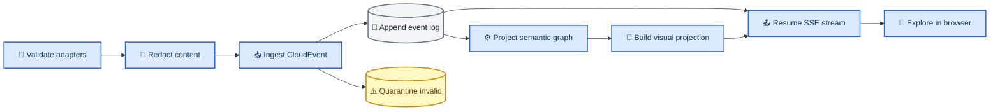
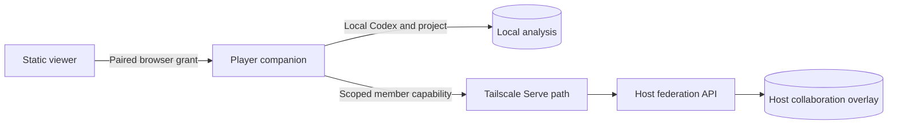

# Evolastra Observatory architecture

_Initial local architecture and system boundaries, aligned with the accepted shared contract_

---

## 📋 Architectural baseline

Evolastra Observatory separates execution telemetry, analytical meaning, and visual presentation. The durable event log and semantic projection are authoritative; both spatial maps are rebuildable views. This prevents renderer concerns from leaking into the records used for lineage, evidence, replay, and export.

| Layer | Responsibility | Authoritative data | Explicitly excluded |
| --- | --- | --- | --- |
| **Operational telemetry** | Records software execution facts | Traces, spans, logs, metrics | Semantic promotion and galaxy coordinates |
| **Semantic graph** | Records analytical meaning and provenance | Runs, nodes, agents, datasets, artifacts, claims, findings, approvals, typed relationships | Camera, animation, and layout state |
| **Visualization projection** | Supports interactive exploration | Disposable coordinates, clusters, labels, camera state, coalesced metrics | Canonical analytical meaning |

The initial profile uses Python 3.12, FastAPI, Pydantic v2, SQLAlchemy 2, Alembic, and SQLite with foreign keys and transactional writes. PostgreSQL is the production persistence target through the same SQLAlchemy models. The browser uses TypeScript, React, Vite, TanStack Query, a focused external store, and a Canvas 2D renderer isolated from React render frequency.

## 🌐 Event and projection flow

The following flow is the canonical write and delivery path. Adapters never write projections directly.

The ingestion endpoints are `POST /api/v1/events` and `POST /api/v1/events/batch`. A successful ingestion transaction allocates the next per-run `sequence`, appends the immutable event, and applies its supported projection updates without silently splitting those outcomes. Duplicate event IDs are idempotent. Invalid envelopes are quarantined with a redacted reason. Unknown event types remain in the event log and are ignored by projections.

## 🔄 Browser transport

The live feed is `GET /api/v1/runs/{run_id}/events/stream?after=<sequence>`. Each Server-Sent Events frame has:

- `id` set to the durable per-run `sequence`
- `event` set to the stable transport name `semantic`; the domain type remains inside the CloudEvent
- `data` set to the complete structured CloudEvent JSON

Clients resume with the `after` query parameter or `Last-Event-ID`. When both are present, the server uses the larger valid sequence so a stale URL cannot move a client backwards. Transport heartbeats keep idle connections observable and report `{runid, sequence, time}` without entering the durable event log. Commands use `POST /api/v1/runs/{run_id}/commands` with a validated `{command, value?}` body; the stream is intentionally unidirectional.

User-authorized ship missions are a separate paired control path. The companion
persists the built vessel as an agent, starts a new Codex thread and turn through
app-server stdio, and records lifecycle updates back into the parent run. Codex
credentials and app-server transport never enter the browser.

Ingestion and animation are separate. Pausing animation does not stop event receipt or persistence. On return to live, the client catches up from its last applied sequence and coalesces high-rate metric updates before touching React state.

## 💾 Persistence and storage

The event table is append-only. Semantic and visualization projection tables can be rebuilt from the ordered event stream. Snapshots accelerate restoration but never supersede the log. Stored events carry both event time and ingestion time, and corrections are new events rather than edits.

Artifacts are content-addressed files beneath a configured storage root. Metadata keeps a logical `art_` identifier separate from the content hash because different analytical objects may contain identical bytes. Clients use opaque artifact IDs; neither event payloads nor URLs expose filesystem paths.

## 🔐 Trust boundaries

The default profile is single-player and loopback-oriented. Phase 1 multiplayer
is an explicit host-authoritative overlay: Tailscale Serve exposes only the
federation route family, while the ordinary companion API stays protected by its
local root or paired-browser grants. It is collaboration among known tailnet
members, not public multi-tenant hosting.

- Redaction occurs before persistence, application logging, or export
- Known secret-shaped content is denied by default
- Imported text and artifacts are data, never executable instructions
- Notebook, HTML, SVG, and generated code content is never executed by preview paths
- CORS, trusted hosts, and security headers are configured centrally
- Risky and destructive actions require a semantic approval record
- Federation invite and member capabilities authorize only collaboration routes
- Raw prompts, datasets, artifacts, and member grants never enter federation persistence

## 🛰️ Multiplayer federation

The host keeps the canonical analysis and a small collaboration overlay in local
SQLite. Guests load the same portable analysis locally and exchange only presence,
player colors, system claims, and explicitly published finding summaries. A
non-secret project fingerprint prevents accidental joins to a different analysis.

Multiplayer state is deliberately outside the semantic event log. Claiming a
system or publishing a summary therefore cannot alter replay, provenance, or a
single-player export. When the host is unreachable, guests retain the last
overlay as a visibly paused view and cannot mutate it.

## 🎯 Determinism and ownership

For a fixed ordered event stream and run seed, semantic state and derived layout are deterministic. Run-seeded hashing and stable radial branch allocation create initial coordinates. User pin overrides live only in projection storage and never mutate semantic entities.

| Concern | Owner |
| --- | --- |
| Incoming event schema | Event protocol |
| Immutable history and sequence | Event store |
| Analytical meaning | Semantic projection |
| Coordinates and camera | Visualization projection |
| Artifact bytes | Storage abstraction |
| Browser server state | TanStack Query |
| High-frequency render state | Focused external store and Canvas renderer |

## 📌 Deliberate non-goals

The initial local implementation does not require Kafka, Kubernetes, Redis, a commercial telemetry backend, AG-UI, A2A, OpenLineage infrastructure, or MLflow. Standards adapters may be added without changing the canonical envelope or making an optional system the source of truth. WebSockets are not required for the browser event feed because validated HTTP commands provide the necessary client-to-server direction.
