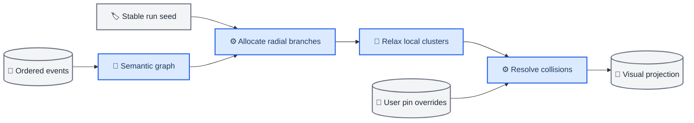

# Visualization projection model

_Disposable, deterministic state for rendering the semantic graph as an interactive galaxy_

---

## 📋 Projection boundary

The visualization projection is derived from the semantic graph and durable event log. It is optimized for rendering and may be deleted and rebuilt. It never becomes the source of truth for analytical meaning, provenance, evidence, approval, or execution status.

| Projection data | Stored here | Canonical semantic record |
| --- | :---: | :---: |
| Coordinates and velocities | Yes | No |
| Cluster and level-of-detail membership | Yes | No |
| Label priority and visibility | Yes | No |
| Camera bookmarks and selected paths | Yes | No |
| User pin overrides | Yes | No |
| Coalesced visual metrics | Yes | No |
| Claims, evidence, lineage, approvals | No | Yes |

Galaxy terms are presentation roles only. A semantic `AnalysisNode` may be rendered as a system, and an `Artifact` may be rendered as an orbiting object, but those words do not enter canonical event payloads.

## ⚙️ Projection records

The initial projection can represent:

- Stable semantic entity ID and entity type
- Run ID and last applied event sequence
- Deterministic `x`, `y`, and `z` coordinates
- Cluster, branch, and level-of-detail keys
- Visual role and non-color status marker
- Label text, priority, and visibility threshold
- Edge endpoints, type, direction, and simplified rendering class
- Aggregated token, cost, runtime, activity, and anomaly indicators
- Thumbnail or preview reference by opaque artifact ID
- User pin and camera bookmark overrides

Derived records include a projection schema version. A schema change triggers rebuild or migration without changing semantic entities.

## 🔄 Deterministic layout

The run seed creates a stable, connected frontier before analysis systems are
claimed. Each new analysis node promotes the next pre-existing frontier star:
the star changes from unclaimed to claimed while retaining its coordinates and
hyperlanes. Semantic signatures—program, alteration direction, genes,
cytobands, mechanisms, therapeutic modalities, and validation modalities—stay
available as analytical labels but do not control spatial distance.

Frontier promotion uses stable event-sequence ordering. The client also keeps a
run-scoped registry of every system position it has issued. Existing coordinates
remain exact through updates, rewind, and replay; only the claim state of a
frontier star changes. User pins remain projection-only state.

## 3D camera and connected topology

The Canvas renderer keeps a deterministic scene and projects it through a perspective camera on every frame. In Galaxy view, strategic systems, hyperlane endpoints, and ownership borders are projected from `z = 0`, matching a Stellaris-style galactic chart plane; background dust retains shallow depth. System view retains three-dimensional orbital depth. Yaw rotates the scene around its galactic axis, pitch tilts the viewing plane, and focal length supplies depth scaling. Projected coordinates are used for drawing and hit testing; semantic entities retain their stable derived coordinates.

The interaction contract is shared by the Galaxy and System views:

- Drag rotates yaw and pitch
- Shift-drag or middle/right drag pans
- The mouse wheel and `+`/`-` control zoom
- `W`/`S` tilt and `A`/`D` rotate
- `Home` restores the mode-specific camera

Connectivity is an explicit projection invariant rather than a distance-based visual side effect. The unclaimed frontier starts with a deterministic minimum-spanning tree and then receives local neighbor lanes. Claimed systems are joined across semantic components by the nearest deterministic bridge. Each claimed system also receives a full-length bridge to its nearest frontier system. Consequently, every generated system belongs to one traversable graph while the semantic edge set remains unchanged.

An anonymous frontier point cannot be claimed as if it already represented a
scientific idea. A workflow first promotes a bounded, falsifiable direction to a
semantic node; only then can the renderer place it and multiplayer claim it.
Player-colored influence regions are derived from claim overlays and never
alter semantic coordinates or canonical evidence. Each owner receives a union
of planar system influence disks and minimum-spanning corridors. A deterministic
grid partition prevents overlapping owners from painting over each other;
contours are simplified and rounded before perspective projection. The prior
and current planar snapshots crossfade during topology changes, while reduced
motion applies the new snapshot immediately.

## ⚡ Streaming and coalescing

The event stream preserves every durable event. The renderer does not render every event as a new object and does not commit every metric sample to React.

1. The network layer receives and orders complete CloudEvents
2. The application cache advances the durable cursor
3. Projection updates enter a bounded client queue
4. Metric updates coalesce by entity and metric key
5. The external render store publishes at a configurable cadence
6. Canvas draws independently from React component rendering

`pause_animation` freezes visual advancement while ingestion and cursor persistence continue. `return_live` drains queued projection updates in bounded batches or replaces them with a current snapshot. It never asks the server to resend already persisted content unless a sequence gap exists.

## 🔍 Level of detail

At distant zoom levels, nodes and edges aggregate by stable branch and cluster keys. Clusters preserve member counts, status summaries, anomaly presence, and exact drill-down identifiers. At closer levels, labels and individual objects progressively appear. Hidden objects remain discoverable through search, inspectors, and the synchronized text tree.

Edge simplification may combine repeated low-level relationships, but evidence, contradiction, lineage, and approval paths must remain recoverable on selection. Visual weight is a derived display value, not semantic confidence.

## 🔐 Accessibility and safety

The Canvas view is never the only access path. A keyboard-operable text tree, typed search, inspectors, tables, and status text expose the same semantic objects. Status always has a non-color encoding. Reduced-motion mode disables nonessential transitions and replaces moving probes with static state indicators.

Artifact previews use sanitized, bounded representations. The renderer receives opaque preview or thumbnail references and does not execute notebook cells, scripts, SVG behavior, generated code, or imported HTML.
