# Agent engineering harness

_Repository navigation, constraints, feedback loops, and planning for reliable agent work_

---

Evolastra's harness makes the repository legible and gives humans and coding
agents short, deterministic feedback loops. It consists of navigation, local
instructions, executable invariants, versioned plans, and staged verification.

## 🔄 Working loop

```mermaid
flowchart LR
    accTitle: Evolastra Agent Working Loop
    accDescr: Coding work moves from repository orientation through diagnosis, planning, implementation, focused testing, fast checks, full verification, and a durable record.

    orient[📚 Read repository guidance] --> diagnose[🔍 Diagnose environment]
    diagnose --> plan[📋 Record cross-cutting plan]
    plan --> edit[✏️ Make bounded change]
    edit --> focused_test[🧪 Run focused test]
    focused_test --> fast_check[⚡ Run fast preflight]
    fast_check --> full_verify[✅ Run release gate]
    full_verify --> record([📝 Record evidence])

    classDef process fill:#dbeafe,stroke:#2563eb,stroke-width:2px,color:#1e3a5f
    classDef success fill:#dcfce7,stroke:#16a34a,stroke-width:2px,color:#14532d

    class orient,diagnose,plan,edit,focused_test,fast_check process
    class full_verify,record success
```



1. **Orient:** read root `AGENTS.md`, the repository map, and the nearest local
   `AGENTS.md`.
2. **Diagnose:** run `npm run doctor` for environment failures.
3. **Plan:** create `docs/plans/active/<date>-<topic>.md` for cross-cutting,
   ambiguous, or multi-session work.
4. **Edit:** keep the patch inside the documented ownership boundary.
5. **Focused test:** run the smallest regression for the changed behavior.
6. **Check:** run `npm run check` for the fast repository preflight.
7. **Verify:** run `npm run verify` before handoff or push.
8. **Record:** update documentation and move a finished plan to `completed/`
   with exact validation evidence.

## ⚡ Command ladder

| Command | Purpose | Network/browser work |
| --- | --- | --- |
| `npm run bootstrap:check` | Pre-install tool versions | None |
| `npm run doctor` | Installed environment diagnosis | None |
| `npm run harness` | Links, guidance, plan metadata, architecture imports, privacy boundary | None |
| Focused pytest/Vitest command | One behavior while iterating | None |
| `npm run check` | Harness, lint, types, Python and frontend unit tests | None |
| `npm run verify` | Release gate, build, audits, browser and accessibility tests | Dependency audit access |

Both `doctor` and `harness` support machine-readable output:

```powershell
python scripts/harness.py doctor --json        # works before setup
python scripts/harness.py check --json         # works before setup
```

## ⚠️ Failure policy

- Treat harness failures as repository design feedback, not formatting noise.
- Re-run the smallest failing command unchanged before editing.
- Repair the root cause; do not weaken an invariant or test to obtain green.
- If a deliberate architecture change conflicts with a rule, follow
  [Changing an invariant](../architecture/invariants.md#changing-an-invariant).
- If documentation and executable behavior disagree, update both in one patch.

## 🔧 Keeping the harness useful

The harness should remain fast, local, deterministic, and explain its remedies.
Add checks for recurring failure modes, not personal preferences. Prefer a small
stdlib check with a regression test over a large framework. Remove obsolete
rules when the corresponding boundary is intentionally retired.

This approach applies OpenAI's harness-engineering pattern: humans define intent
and constraints while repository tooling gives agents the context and feedback
needed to execute reliably.[^1]

## 🔗 References

[^1]: OpenAI. (2026). "Harness engineering: Leveraging Codex in an agent-first world." https://openai.com/index/harness-engineering/
