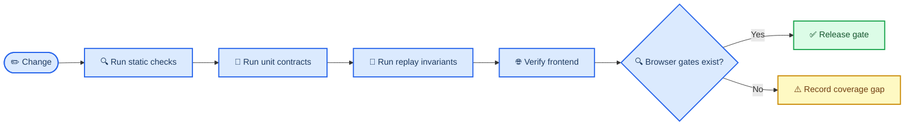

# Testing and release verification

_Practical test strategy for the Evolastra Observatory local profile_

---

## 📋 Release gate

Install the Python project and development dependencies before using the repository-wide commands:

```powershell
powershell -ExecutionPolicy Bypass -File .\scripts\setup.ps1
npm run verify
```

`npm run verify` is the release gate. It runs Python lint, Python type checking, the complete Python test suite, frontend type checking, frontend tests, the production frontend build, asset verification, and the security scan. A focused reliability run is available while iterating:

```powershell
python -m pytest tests/quality tests/property tests/chaos -q -rxX
```

For the normal agent feedback ladder, use:

```powershell
npm run harness  # repository shape and architecture boundaries
npm run check    # harness, static checks, Python and frontend unit tests
npm run verify   # full release gate
```

Expected failures must have a defect ID and a narrow assertion. An unexpected pass is actionable: remove the marker only after the fix and its surrounding regression suite have been verified.

## 🧪 Test layers

| Layer | Location | Primary contract |
| --- | --- | --- |
| Domain and API | `tests/test_*.py` | Core reducers, persistence, API resources, exports |
| Standards contracts | `tests/contracts/` | JSON Schema and protocol fixtures |
| Integrations | `tests/integrations/` | Adapter mapping, redaction, deduplication |
| Security | `tests/security/` | Trust boundaries and known control gaps |
| Quality | `tests/quality/` | Replay, snapshots, simulator shape, exports, SSE resume |
| Property invariants | `tests/property/` | Ordering, idempotency, immutability, unknown-event tolerance |
| Chaos scenarios | `tests/chaos/` | Mixed batches, event floods, failed retry behavior |
| Frontend unit | `apps/web/src/*.test.ts` | Deterministic layout and client logic |
| Browser and accessibility | `apps/web/e2e/` | End-to-end interaction, replay, semantic views, and axe serious/critical scan |

The reliability path is intentionally layered:



## 💾 Isolation and fixtures

Reliability tests use SQLite in-memory engines with `StaticPool`. They do not use the configured application database, artifact root, network services, or an external broker. Every fixture creates and disposes its own schema.

Use generated UUIDv4 identifiers that satisfy the production validators. Event fixtures must contain every required extension field. Tests that submit a client sequence must state whether it is expected to be accepted, deduplicated, or quarantined.

Time, UUID generation, and random seeds are controlled when the behavior under test is deterministic. Do not normalize volatile fields out of a determinism assertion unless the contract explicitly defines them as volatile.

## 🔄 Reliability invariants

The following invariants are release-relevant:

- Duplicate event IDs create no second event or projection mutation
- A conflicting duplicate cannot rewrite the original payload
- Only the next per-run sequence is accepted
- Gaps and reordered events enter quarantine
- Unknown types remain durable and do not mutate supported projections
- Snapshot restore equals independent replay at the same sequence
- Rebuild equals the current projection for the full ordered stream
- Exact metric events remain durable while visual metrics stay bounded
- SSE resume uses the greater of `after` and `Last-Event-ID`
- Exports preserve sequence order and never restore redacted content
- Projection health detects event gaps and stale projection cursors

The five reliability defects discovered by this workstream now have ordinary passing regression tests. See [`quality-report.md`](../audit/quality-report.md) for the before-and-after evidence.

## ⚠️ Expected-failure policy

Use `pytest.mark.xfail(..., strict=True)` only when all of these conditions hold:

1. The defect has been reproduced independently
2. The test asserts the desired contract, not the current bug
3. The marker includes a stable defect ID and root-cause summary
4. The defect appears in the quality report
5. The owner removes the marker with the fix

Never convert a flaky or poorly understood test into an expected failure. A failure without a known cause stays a release blocker.

## 🌐 Browser and accessibility coverage

Playwright verifies live demo growth, synchronized views, search, replay/return-live, and an axe scan with no serious or critical violations. The remaining recommended coverage is:

The Playwright harness owns an isolated development API on loopback port 8011
and selects it through session-scoped browser state. It never reuses or mutates
an installed paired companion on the production default port 8000.

- Disconnect/resume and export downloads in Chromium and Firefox
- Full keyboard-only navigation through tree, search, inspectors, dialogs, and approvals
- Manual screen-reader checks
- Reduced-motion verification with ambient animation disabled
- High-contrast and 200% text scaling checks
- Cross-browser SSE recovery and long-session behavior
- Canvas-to-text-tree count, selection, and status equivalence

The Canvas view cannot be considered accessible from unit tests alone. Browser automation supplements, but does not replace, keyboard and assistive-technology review.

## 🔍 Failure triage

When a test fails:

1. Re-run the smallest failing test without changing seed or data
2. Read the full assertion and captured output
3. Compare the failing path with a passing reference path
4. Classify the cause as implementation defect, invalid fixture, environment problem, or flaky test
5. Add the smallest regression assertion before changing production code
6. Re-run the focused suite and the complete release gate

Do not delete state, loosen an assertion, or change a seed merely to obtain a pass.

## 🔗 References

- [Quality report](../audit/quality-report.md)
- [Performance verification](./performance.md)
