# Get started with Evolastra

_Estimated time: 0–10 minutes · Beginner · Last verified: 2026-07-19 on Windows_

---

## 📋 Choose your path

| Goal | Recommended path | Result |
| --- | --- | --- |
| See the finished showcase | Open the hosted app and choose **Explore public demo** | Read-only three-empire map, replay, findings, and figures; no install |
| Use Evolastra with Codex | [Bootstrap the companion](#-install-for-codex) | Persistent local observatory and managed hooks |
| Explore the product | [Run the demo](#-run-the-demo-only) | Temporary seeded investigation |
| Ask an agent to install it | [Copy the agent prompt](#-let-an-agent-set-it-up) | Agent follows the repository contract |

The supported installation flow keeps all analytical data on the same computer:

```mermaid
flowchart LR
    accTitle: Evolastra Installation Flow
    accDescr: The supported path validates prerequisites, installs locked dependencies, builds the viewer, starts the local companion, activates Codex hooks, and pairs a browser tab.

    check[🔍 Check prerequisites] --> install[📦 Install locked packages]
    install --> build[⚙️ Build observatory]
    build --> companion[🖥️ Start local companion]
    companion --> hooks[🔌 Activate Codex hooks]
    hooks --> pair[🔐 Pair browser tab]
    pair --> ready([✅ Observatory ready])

    classDef action fill:#dbeafe,stroke:#2563eb,stroke-width:2px,color:#1e3a5f
    classDef success fill:#dcfce7,stroke:#16a34a,stroke-width:2px,color:#14532d

    class check,install,build,companion,hooks,pair action
    class ready success
```



## 📋 Prerequisites

| Requirement | Version | Verify | Installation |
| --- | ---: | --- | --- |
| Windows | 10 or newer | `Get-ComputerInfo` | Included with the computer |
| Python | 3.12+ | `python --version` | [Python downloads][python-downloads] |
| Node.js | 20+ | `node --version` | [Node.js downloads][node-downloads] |
| npm | 10+ | `npm --version` | Included with Node.js |
| Git | Current release | `git --version` | [Git downloads][git-downloads] |

Run the safe prerequisite check after cloning:

```powershell
npm run bootstrap:check
```

If PowerShell reports that `npm.ps1` cannot be loaded because script execution
is disabled, invoke the executable shim instead:

```powershell
npm.cmd run bootstrap:check
```

Expected result:

```json
{
  "ready": true,
  "platform": "windows",
  "python": "3.12.x",
  "node": "20.x.x",
  "npm": "10.x.x"
}
```

## ⚡ Install for Codex

### Step 1: Clone the public repository

No GitHub account is required:

```powershell
git clone https://github.com/Paureel/evolastra.git
Set-Location evolastra
```

### Step 2: Run the bootstrap

```powershell
npm run bootstrap
```

To use the hosted viewer instead of only the local viewer, run the bootstrap
with its exact origin:

```powershell
powershell -NoProfile -ExecutionPolicy Bypass -File .\scripts\bootstrap.ps1 -NoBrowser -Origin https://evolastra.netlify.app
```

The bootstrap validates tool versions, creates `.venv`, installs both lockfiles, applies migrations, builds the static viewer, installs the Local Private companion and Codex hooks, verifies the service, and opens `http://127.0.0.1:8000`.

Expected final output:

```text
Evolastra is ready.
  Viewer:    http://127.0.0.1:8000
  Companion: running
  Hooks:     True (10 managed events)
```

> 📌 **No administrator shell is required.** Evolastra writes its service state under `~/.evolastra` and its managed hooks under `~/.codex`.

### Step 3: Restart Codex once

Restart Codex after the first hook installation. Open `/hooks`, review the Evolastra commands, and approve them once. A session that began before hook activation cannot retrospectively appear in the live view.

### Step 4: Pair the browser

When the viewer asks for a pairing code, run:

```powershell
& .\.venv\Scripts\evolastra.exe pair
```

Enter the displayed one-use code in the browser. Pairing creates a short-lived, origin-bound browser grant; it does not reveal the root companion token.
The code must contain all twelve characters and both hyphens in the form
`XXXX-XXXX-XXXX`; it expires after five minutes and works once.

## ⚡ Run the demo only

The easiest option needs no local setup: open the hosted viewer and choose
**Explore public demo**. It loads the one curated, aggregate-only Stomach
Adenocarcinoma (STAD) Copy Number Alteration (CNA) three-empire expedition from
the static host. You can rotate and zoom the map, replay its twelve named
research phases, inspect all six figures, and watch the three territories emerge.
Shipbuilding, publishing, import/export, and other mutations are disabled.

For the separate mutable local seed demo without Codex hooks:

```powershell
powershell -NoProfile -ExecutionPolicy Bypass -File .\scripts\setup.ps1
npm run demo
```

Open `http://127.0.0.1:5173/?development-demo=1`. This explicit development
URL is the only browser surface that shows the synthetic churn fixture; normal
and production sessions exclude seeded development runs. Stop the temporary demo
with `Ctrl+C`.

## 🤖 Let an agent set it up

The root [`AGENTS.md`](../AGENTS.md) is the authoritative agent contract. Paste this into Codex or another capable coding agent after it has access to the checkout:

```text
Set up Evolastra from this checkout. Read AGENTS.md and docs/getting-started.md first.
Run npm run bootstrap:check, then run scripts/bootstrap.ps1 with `-NoBrowser`
and `-Origin https://evolastra.netlify.app`.
Verify the companion and Codex hook status. Preserve the local-private boundary and
never read or print the root companion token. If hooks changed, tell me to restart
Codex and approve /hooks once. Generate a pairing code only when I say I am ready.
```

Agents should use the bundled [`evolastra` skill](../skills/evolastra/SKILL.md) when available. Its controller can diagnose or repair an existing installation without reconstructing service commands.

The hosted viewer publishes the same bounded instructions at
[`/agent-setup.md`](https://evolastra.netlify.app/agent-setup.md) and an agent
discovery index at [`/llms.txt`](https://evolastra.netlify.app/llms.txt).

## ✅ Verify the installation

| Check | Command | Expected result |
| --- | --- | --- |
| Companion | `& .\.venv\Scripts\evolastra.exe service status` | `installed` and `running` are `true` |
| Codex hooks | `& .\.venv\Scripts\evolastra.exe codex status` | `installed` is `true`, `events` is `10` |
| Viewer | Open `http://127.0.0.1:8000` | Pairing or observatory screen appears |
| Full release gate | `npm run verify` | `Practical release gate passed.` |

## 🔧 Common options

```powershell
# Do not open a browser; recommended for agents and remote shells
.\scripts\bootstrap.ps1 -NoBrowser

# Start the companion automatically after Windows login
.\scripts\bootstrap.ps1 -Autostart

# Allow a specific static hosted viewer origin
.\scripts\bootstrap.ps1 -Origin https://your-site.example

# Install the product without changing Codex hooks
.\scripts\bootstrap.ps1 -NoHooks
```

## 🔧 Troubleshooting

### PowerShell blocks the script

Use the repository command, which applies a process-scoped execution-policy override:

```powershell
powershell -NoProfile -ExecutionPolicy Bypass -File .\scripts\bootstrap.ps1
```

### A required tool is missing or too old

Run `npm run bootstrap:check`. Its error names the missing tool and minimum version. Install or upgrade that tool, open a new terminal, and rerun the check.

### Port 8000 is already in use

Choose another port:

```powershell
.\scripts\bootstrap.ps1 -Port 8010
```

Then open `http://127.0.0.1:8010`.

### Codex repeatedly asks whether to trust hooks

1. Finish the bootstrap once.
2. Close every Codex window.
3. Start Codex again.
4. Open `/hooks`, review the Evolastra commands, and approve them.
5. Verify with `& .\.venv\Scripts\evolastra.exe codex status`.

Do not repeatedly reinstall hooks; installation is idempotent and preserves unrelated hook registrations.

### The viewer cannot reach the companion

```powershell
& .\.venv\Scripts\evolastra.exe service status
& .\.venv\Scripts\evolastra.exe service start
```

For a hosted viewer, reinstall with its exact scheme and hostname using `-Origin`, then restart the companion. See [Local Private deployment](deployment/local-private.md).

### Hosted viewer says `Failed to fetch`

This usually means the installation is healthy but the browser has blocked the
public HTTPS page from reaching the loopback companion.

1. Confirm that the companion is running and the exact Netlify origin is
   allowed:

   ```powershell
   & .\.venv\Scripts\evolastra.exe service status
   curl.exe -i http://127.0.0.1:8000/api/v1/pairing/info -H "Origin: https://evolastra.netlify.app"
   ```

   The probe should return HTTP `200` and
   `Access-Control-Allow-Origin: https://evolastra.netlify.app`. If it does not,
   rerun the hosted bootstrap command from Step 2.

2. Open `https://evolastra.netlify.app` in ordinary Chrome. The Codex in-app
   browser may deny loopback access without exposing a permission prompt.
3. In Chrome's site settings for Evolastra, allow **Local network access** or
   **loopback network access**, then reload and generate a fresh pairing code.
4. If no permission appears or the profile has stale state, launch an isolated
   Chrome profile:

   ```powershell
   $chrome = @(
       "${env:ProgramFiles}\Google\Chrome\Application\chrome.exe",
       "${env:ProgramFiles(x86)}\Google\Chrome\Application\chrome.exe"
   ) | Where-Object { Test-Path -LiteralPath $_ } | Select-Object -First 1

   if (!$chrome) { throw "Google Chrome was not found." }

   $profile = Join-Path $env:LOCALAPPDATA "Evolastra\ChromeProfile"
   New-Item -ItemType Directory -Force -Path $profile | Out-Null
   $profileArgument = '--user-data-dir="' + $profile + '"'

   Start-Process -FilePath $chrome -ArgumentList @(
       '--new-window',
       '--no-first-run',
       '--no-default-browser-check',
       $profileArgument,
       'https://evolastra.netlify.app/'
   )
   ```

   Keep the quotes inside the complete `--user-data-dir="..."` argument when
   the Windows path contains spaces; otherwise Chrome may silently reuse the
   old profile.

If `http://127.0.0.1:8000` works but Netlify still does not, the companion and
pairing exchange are available—the remaining problem is the browser's
hosted-origin-to-loopback permission. Use the local viewer if browser or
enterprise policy cannot grant that permission. Never expose the companion on
a non-loopback address to work around it.

## 🔗 Next steps

- [Galaxy and System map guide](user-guide/galaxy.md)
- [Local Private operations](deployment/local-private.md)
- [Codex hook integration](integration/codex-hooks.md)
- [Portable analyses](user-guide/portable-analyses.md)
- [Development and verification](development/testing.md)

[python-downloads]: https://www.python.org/downloads/windows/ "Python for Windows"
[node-downloads]: https://nodejs.org/en/download "Node.js downloads"
[git-downloads]: https://git-scm.com/download/win "Git for Windows"
