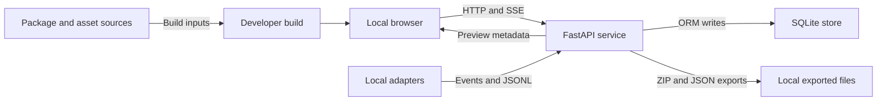

# Evolastra Observatory threat model

Reviewed: 2026-07-18
Profiles: development loopback, Local Private companion, and static hosted viewer

## Executive summary

Local Private uses mandatory bearer authentication, one-use pairing codes, short-lived origin-bound browser grants, exact CORS/Host allowlists, Private Network Access preflight handling, a user-private root token, and production rejection of non-loopback clients. The public deployment is static viewer code with no API or persistence. Action-specific business invariants, referential integrity, resource budgets, and physical-copy retention remain material hardening areas.

## Scope and assumptions

In scope:

- FastAPI runtime under `apps/api/asterism_api/`;
- React/Vite client under `apps/web/`;
- ingestion adapters and SDK sinks under `integrations/` and `sdk/`;
- SQLite persistence, JSONL import, SSE, exports, preview metadata, redaction, destructive actions, and build/asset supply chain;
- runtime and security-relevant build/test configuration in root manifests.

Assumptions established by the shared contract:

- Local Private binds to loopback for one local operator. Its browser and adapters use bearer authorization; no authentication cookies are used.
- The hosted viewer is internet-deployable static content. Its runtime endpoint policy and CSP allow API connections only to loopback.
- Telemetry, imported JSONL, semantic fields, artifact metadata, and adapter output are untrusted data.
- HTML, SVG, notebooks, generated code, and uploaded artifacts are never executed. The current preview is metadata/structured data only.
- The local operating-system account and its filesystem are outside the application's isolation boundary. A process with the same user's file permissions can read or alter local data directly.

Out of scope: identity-provider design, tenant isolation, cloud operating-system hardening, and plugin behavior in applications that open exported files. TLS termination is represented by deployment configuration but remains an infrastructure responsibility.

Open questions that change risk ranking:

- Will a future release bind beyond loopback, sit behind a reverse proxy, or accept browser access from origins other than the packaged UI?
- What retention/erasure promise applies to confidential or restricted runs, including SQLite WAL, backups, exports, and content-addressed artifact blobs?
- Will adapters remain same-user local processes, or will remote/third-party producers require authenticated ingestion identities?

## System model

### Primary components

- **React client:** loads run summaries/state, parses authenticated resumable SSE over `fetch`, issues validated commands, renders untrusted strings through normal JSX, and renders preview values/text without HTML interpretation.
- **FastAPI service:** exposes health, run, ingestion, import, quarantine, command, approval, search, preview, export, and SSE routes (`apps/api/asterism_api/api.py:57-369`).
- **Security middleware:** validates Host, applies CORS, rejects unsafe cross-origin/Fetch-Metadata requests, counts actual ASGI body bytes, and adds API security headers (`apps/api/asterism_api/main.py:22-59`, `80-117`).
- **Event store/projector:** redacts before normal ingestion, validates the CloudEvent envelope plus every registered v1 entity/action payload against a generic structural floor, persists events/quarantine/snapshots, and projects event data into run state (`apps/api/asterism_api/event_store.py:102-271`, `apps/api/asterism_api/reducer.py:26-162`).
- **SQLite and artifact root:** SQLite holds events, projections, snapshots, quarantine, and audit records; an artifact directory is created but file-backed artifact serving is not implemented (`apps/api/asterism_api/db_models.py:11-82`, `apps/api/asterism_api/main.py:21-25`).
- **Adapters/SDKs:** collect external telemetry, perform bounded/default-deny redaction, spool JSONL, and emit to configured HTTP endpoints (`integrations/core.py:25-113`, `integrations/codex_hooks.py:69-139`, `sdk/python/galaxy_sdk/client.py:43-65`).
- **Exporters:** create JSON, JSONL, PROV, OpenLineage, Obsidian ZIP, and reproduction ZIP responses in memory (`apps/api/asterism_api/api.py:355-369`, `apps/api/asterism_api/exports.py:20-154`).

### Data flows and trust boundaries

- **Browser -> FastAPI:** run IDs, queries, commands, approvals, and replay cursors cross HTTP; live events return over authenticated SSE. Protected routes require a root or origin-bound session bearer. Host/CORS allowlists and unsafe-method Origin/Fetch-Metadata checks are also enforced. There is not yet a route-rate-limit layer.
- **Local adapter/script -> FastAPI:** untrusted CloudEvents and JSONL cross loopback HTTP/multipart. Actual bytes are bounded and redaction, envelope validation, and registered-v1 payload validation occur before persistence (`main.py:22-59`, `api.py:179-218`, `event_store.py:235-271`).
- **FastAPI -> SQLite:** redacted event envelopes, derived state, snapshots, quarantine payloads, and minimal audits cross the ORM boundary. SQLAlchemy query construction avoids observed string-built SQL (`event_store.py:125-228`, `database.py:22-38`).
- **FastAPI -> browser/exported files:** semantic state and event history cross JSON/SSE/download boundaries. Preview content remains data, while Obsidian export intentionally emits Markdown that must remain untrusted downstream (`api.py:346-369`, `exports.py:92-154`).
- **Dependency/asset sources -> developer build:** Python/npm packages and future visual assets cross a supply-chain boundary. Direct Python versions are pinned but unhashed; npm has a committed lockfile; visual assets currently have a complete empty manifest (`pyproject.toml:7-29`, `apps/web/package-lock.json`, `docs/assets/asset-manifest.json`).

#### Diagram

## Assets and security objectives

| Asset | Why it matters | Security objective (C/I/A) |
|---|---|---|
| Durable event history and trace context | Source of execution truth and replay | I, A, sometimes C |
| Semantic claims, findings, approvals, and lineage | Decisions depend on accurate provenance | I, A |
| Run state, snapshots, and quarantine payloads | Can retain prompts, errors, dataset descriptions, and secrets missed by redaction | C, I |
| Audit trail | Needed to explain deletion, retry, approval, and risky commands | I, A |
| Artifact metadata and future content-addressed blobs | May contain confidential research/data outputs | C, I, A |
| Local service availability | Live observability and approval workflows depend on responsiveness | A |
| Exports and reproduction bundles | Portable copies can outlive local retention controls | C, I |
| Redaction rules and privacy configuration | Failure exposes credentials or captured content broadly | C, I |
| Source, dependencies, and visual assets | Compromise executes in developer/browser/API contexts | I, C, A |

## Attacker model

### Capabilities

- Operate a hostile webpage in the local user's browser and attempt requests to `127.0.0.1`/`localhost`; browser Private Network Access behavior is not assumed universal.
- Run or compromise an untrusted same-host adapter/script that can connect to the loopback API.
- Submit malformed, oversized, deeply nested, semantically inconsistent, duplicated, or secret-bearing telemetry and multipart/JSONL input.
- Cause a user to open exported Markdown/ZIP content in another tool, while that content remains untrusted.
- Publish a compromised dependency or asset that a developer installs when reproducibility/provenance gates are absent.

### Non-capabilities

- A remote internet attacker cannot directly reach a correctly loopback-bound server under the verified profile.
- There are no cookies/tokens to steal, no account authentication to bypass, and no cross-tenant boundary in the current profile.
- Untrusted HTML/SVG/notebooks are not rendered or executed by the current previewer.
- The application cannot protect data from another process already holding the same OS user's filesystem privileges.

## Entry points and attack surfaces

| Surface | How reached | Trust boundary | Notes | Evidence (repo path / symbol) |
|---|---|---|---|---|
| Event ingestion | `POST /api/v1/events` and `/events/batch` | Adapter -> API | Redaction/envelope validation and generic validation for every registered v1 entity/action payload; no producer identity | `api.py:179-193`; `event_store.py:102-140`, `235-271` |
| JSONL import | Multipart POST | Browser/script -> multipart parser -> API | ASGI bytes and handler reads are bounded; source manifest pins multipart 0.0.31 | `main.py:22-59`; `api.py:196-218`; `requirements.txt:9` |
| Demo/state-changing commands | Unsafe HTTP methods | Browser -> API | Unapproved Origin and cross-site Fetch Metadata rejected; no auth in local profile | `main.py:91-101`; `api.py:72-129`, `149-156`, `307-352` |
| SSE | EventSource GET and `Last-Event-ID` | Browser/script -> long-lived API response | Resume supported; no connection quota/rate limit | `api.py:218-253` |
| Search/state/export | GET routes | Browser/script -> API/DB | Large projected state and exports can amplify CPU/memory | `api.py:108-147`, `310-383` |
| Artifact preview | Selected artifact metadata | Persisted untrusted data -> React | JSX/preformatted text; no raw HTML execution | `ArtifactPreview.tsx:3-27` |
| Obsidian/reproduction export | ZIP download | Persisted data -> local files/other app | Paths normalized; Markdown/front matter not escaped | `exports.py:92-154` |
| Quarantine retry/delete | POST/DELETE | Local operator/browser -> DB | Retry preserves/increments the original record on failure; action still lacks a dedicated audit entry | `api.py:119-129`, `242-265` |
| Adapter spool/HTTP sink | CLI/operator configuration | Agent process -> local files/network | Bounded capture; endpoint/path are operator-controlled | `codex_hooks.py:69-139`; `client.py:43-65` |
| Build dependencies/assets | Install/build commands | Registries/sources -> developer/browser/API | npm and hash-locked Python installs, audits, and asset scanning are present | `apps/web/package-lock.json`; `requirements.lock`; `docs/assets/asset-manifest.json` |

## Top abuse paths

1. **Poison analytical provenance within the structural floor:** submit a registered payload with valid IDs/schema/run relationship but semantically invalid action fields or nonexistent cross-entity references -> generic validation passes -> reducer presents misleading lineage or approvals.
2. **Exhaust within accepted budgets:** send many individually bounded requests/events or exploit projection deep-copy cost -> per-request byte control passes -> CPU/database work accumulates because no rate or processing budget exists.
3. **Run a stale environment:** launch from the current global interpreter -> vulnerable `python-multipart 0.0.9` is used despite the corrected manifest -> crafted multipart input reaches old parser code.
4. **Retain a physical copy after logical deletion:** delete a run -> owned rows are removed with secure-delete enabled -> older WAL frames, backups, or prior exports remain outside transactional deletion.
5. **Exfiltrate a missed credential:** place a credential in an exception/semantic string or format not shared across divergent redactors -> event/snapshot/SSE/export copies it -> exposure broadens.
6. **Tie up stream/export resources:** open many SSE connections or request large all-event ZIP/JSON exports -> sessions/event lists/ZIP buffers accumulate -> local UI becomes unavailable.
7. **Abuse downstream Markdown:** inject YAML/Markdown/link syntax into semantic titles or findings -> export to Obsidian -> user opens it with a permissive plugin/tool -> content becomes an active social-engineering or downstream-parser surface.
8. **Compromise the build:** exploit the missing hash-locked Python resolution or a compromised locked dependency source -> developer installs it -> malicious build/runtime code executes.

## Threat model table

| Threat ID | Threat source | Prerequisites | Threat action | Impact | Impacted assets | Existing controls (evidence) | Gaps | Recommended mitigations | Detection ideas | Likelihood | Impact severity | Priority |
|---|---|---|---|---|---|---|---|---|---|---|---|---|
| TM-001 | Hostile webpage/local process | User runs the loopback API while visiting attacker content or a local process can connect | Trigger unsafe methods without authority | Persistent state changes, CPU/disk exhaustion | Availability, run/event integrity | Unsafe methods reject unapproved Origin and cross-site Fetch Metadata; CORS and TrustedHost remain (`main.py:80-101`) | No local capability for a same-host process; expensive routes lack rate limits | Keep loopback binding; add route budgets and optionally a per-launch capability if same-host untrusted processes enter scope | Count rejected origins and unsafe requests; rate-limit demo/import | Low | High | low |
| TM-002 | Malformed adapter/request | Can send HTTP to loopback | Send oversized or many parser-amplifying bodies | Memory/CPU exhaustion | API/DB availability | Actual ASGI body bytes and JSONL reads are bounded; locked runtime uses multipart 0.0.31 (`main.py:22-59`, `api.py:196-201`, `requirements.lock`) | No route rate/CPU budget; requests are buffered up to the cap | Server caps; endpoint quotas/timeouts; projection processing budget | Body rejects, parse duration, batch size, long requests | Medium | High | medium |
| TM-003 | Malicious/buggy producer | Can submit a structurally valid registered event | Forge action-specific fields, nonexistent references, or oversized preview/semantic shapes within the generic schema floor | Misleading evidence, broken projection, UI crashes | Provenance and semantic integrity | Envelope validation, sequencing, quarantine, and generic entity/ID/schema/run checks for every registered v1 action (`event_store.py:102-140`, `235-271`; `reducer.py:26-58`) | Full per-action field schemas, cross-entity existence checks, and semantic size bounds are not uniformly enforced | Add action-specific Pydantic/JSON-Schema models; enforce references and bounded preview schemas; keep unknown types opaque/ignored | Quarantine counts by schema/error; alert on invalid references/IDs | Medium | High | medium |
| TM-004 | Operator expecting deletion | A run has snapshots/quarantine/artifacts | Delete run through REST | Residual physical copies remain outside logical rows | Privacy, stored state | Transaction deletes events, snapshots, quarantine, and run; SQLite secure-delete enabled (`api.py:119-129`, `database.py:28-36`) | WAL history, backups, prior exports, audit title, and future blob references need policy | Define WAL checkpoint/backup/export/blob handling; retain only content-free tombstone | Post-delete orphan scan and retention report | Medium | Medium | medium |
| TM-005 | Secret-bearing telemetry | Secret uses an unrecognized key/value form | Redactor misses it and downstream copies proliferate | Credential/content disclosure | Events, snapshots, quarantine, SSE, exports | API key normalization covers camelCase examples; recursive redaction/capture-off remain (`security.py:7-56`, `event_store.py:102-109`) | Three redactors still diverge in bounds/detectors; semantic create-run path bypasses ordinary ingest redaction | One conformance corpus/spec; equivalent bounded traversal and secret detectors; scan semantic strings | Synthetic canary tests; scan persisted/exported fixtures; redaction counters without raw values | Medium | High | medium |
| TM-006 | Local client/process | Can open connections or request exports | Hold many SSE streams or generate large in-memory exports | Resource exhaustion | Availability | SSE batches 250 and heartbeats; event listing capped (`api.py:133-147`, `218-253`) | No connection quota/rate/idle budget; exports materialize all events and ZIP in memory | Per-client/run stream caps, cancellation, bounded queues; stream large exports; maximum export size | Active SSE gauge, export bytes/duration, cancellation counts | Medium | Medium | medium |
| TM-007 | Malicious semantic content | Content reaches artifact/export state | Craft preview shape/Markdown/YAML/links for downstream interpretation | Client crash, misleading content, possible downstream active-content abuse | UI availability, exported files | React escaping and text `<pre>`; no raw HTML (`ArtifactPreview.tsx:12-27`) | Preview schema not runtime-enforced; Obsidian Markdown/front matter not escaped or labeled per field | Strict preview union/row/value bounds; YAML quoting; filename uniqueness; escape/neutralize active links or visibly mark untrusted sections | Preview validation rejects; export lint; hostile Markdown fixtures | Medium | Medium | medium |
| TM-008 | Local operator/malware | Can call destructive/risky routes | Retry quarantine, change simulator, approve, or delete without a complete audit trail | Reduced forensic accountability | Audit/provenance | Durable approval events; delete/rebuild audit (`api.py:97-105`, `123-130`, `277-302`) | Quarantine retry/commands/demo start are not audited; retry deletes original before outcome | Audit every risky command with redacted details/outcome; retain quarantine tombstone; append-only audit export | Audit coverage tests and action/event reconciliation | High | Medium | medium |
| TM-009 | Compromised registry/source | Developer performs install/build | Supply changed/unverified package or visual asset | Developer/runtime code execution or asset-license compromise | Source/build/browser/API | Hash-locked Python and npm installs, full audits, executable source/asset scans, and first-party asset verifier | No generated distribution SBOM or signed provenance | Retain locked clean installs; add SBOM/signing/provenance review | CI audit/SBOM diff, runtime-version check, lock drift and asset checksum gates | Medium | High | medium |
| TM-010 | Remote user in future deployment | Service is exposed beyond loopback or gains multiple users | Read/mutate any run and approval because no identity/tenant checks | Full confidentiality/integrity loss across users | All application data | Explicitly documented loopback single-user boundary | No authN/authZ/tenant isolation/TLS production profile | Block non-loopback startup by default; require a new threat model plus centralized authN, object/tenant authZ, TLS/proxy trust, CSRF/session design | Startup exposure check, auth coverage tests, tenant isolation tests | Low in verified profile | High | low |

## Criticality calibration

- **Critical:** direct pre-auth code execution or broad secret/run exfiltration in the verified loopback profile; or any auth/tenant bypass if a hosted multi-user profile is introduced. Examples: executing uploaded notebook/HTML, arbitrary file write from an exposed parser, cross-tenant export.
- **High:** realistic same-host/browser/adapter actions that corrupt provenance, expose confidential run data, or make the local service materially unavailable. No unresolved code-control gap in this remediation set is currently ranked high after the registered-payload fix.
- **Medium:** bounded local DoS, incomplete forensics, downstream-content hazards requiring user action, or supply-chain gaps without a demonstrated compromised package. Examples: SSE exhaustion, missing command audit, unescaped Obsidian content.
- **Low:** hardening or conditional issues with unlikely current prerequisites. Examples: public OpenAPI in development, lack of TLS on loopback, missing multi-user auth while exposure remains explicitly unsupported.

## Focus paths for security review

| Path | Why it matters | Related Threat IDs |
|---|---|---|
| `apps/api/asterism_api/main.py` | Network boundary, host/CORS/body limits, headers | TM-001, TM-002, TM-010 |
| `apps/api/asterism_api/api.py` | All routes, multipart, SSE, destructive actions, exports | TM-001, TM-002, TM-004, TM-006, TM-008 |
| `apps/api/asterism_api/event_store.py` | Redaction, validation, sequencing, snapshots, quarantine, audit | TM-003, TM-004, TM-005, TM-008 |
| `apps/api/asterism_api/schemas.py` | Envelope validation boundary and extra-field policy | TM-003 |
| `apps/api/asterism_api/reducer.py` | Arbitrary event data becomes semantic/UI state | TM-002, TM-003, TM-007 |
| `apps/api/asterism_api/security.py` | Persistence-time redaction | TM-005 |
| `apps/api/asterism_api/exports.py` | In-memory exports, Markdown/YAML/path construction | TM-004, TM-006, TM-007 |
| `apps/web/src/components/ArtifactPreview.tsx` | Untrusted preview rendering boundary | TM-007 |
| `apps/web/index.html` | Static CSP and local API connection policy | TM-001, TM-007 |
| `integrations/core.py` and `sdk/typescript/src/index.ts` | Divergent redaction implementations | TM-005 |
| `integrations/codex_hooks.py` and `sdk/python/galaxy_sdk/client.py` | Spool/network/filesystem sinks | TM-005, TM-009 |
| `requirements.lock`, `pyproject.toml`, `apps/web/package-lock.json` | Dependency reproducibility and advisories | TM-009 |
| `docs/assets/asset-manifest.json` | Visual-asset origin/license/checksum gate | TM-009 |

## Quality check

- [x] REST, multipart, SSE, preview, export, adapter spool, database, and build entry points covered.
- [x] Browser/API, adapter/API, API/database, export/downstream, and supply-chain boundaries represented in threats.
- [x] Runtime findings separated from build/test and future hosted risks.
- [x] Explicit deployment assumptions from the shared contract applied without a clarification pause.
- [x] Conditional internet/multi-user risks are not represented as current exposure.
